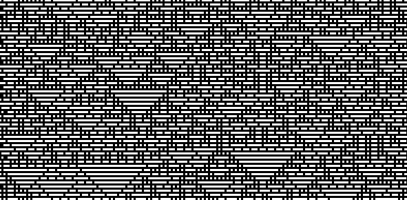

# Cellular-Automata-1D

This is a simple implementation of Elementary Cellular Automata using C++ and SFML Library for Graphics.

- - - -

## Example <Rule : 167>


## Build 🛠️
1. Make sure you have SFML installed. You can download it from [SFML's official website](https://www.sfml-dev.org/).
2. Clone this Repository,
``` bash
https://github.com/Shubhm1shra/Cellular-Automata_1D.git)https://github.com/Shubhm1shra/Cellular-Automata_1D.git
```
3. Compile using prefered compiler,
``` bash
g++ CellularAutomaton.cpp AutomataCal.cpp -o main main.cpp -I"path/to/your/SFML/include" -L"path/to/your/SFML/libs" -lsfml-graphics -lsfml-window -lsfml-system
```

## Run 🏃‍♂️
Run the executable,
``` bash
./main
```

## Controls 🕹️
Press Escape Key to exit.

## Customize 🧩
Feel Free to customize the parameters in `main.cpp` file, to change number of rows, number of columns, Cell size and Rule Number.

Thank you!
